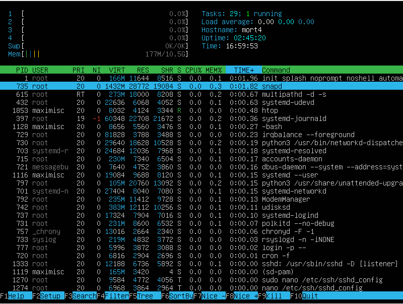
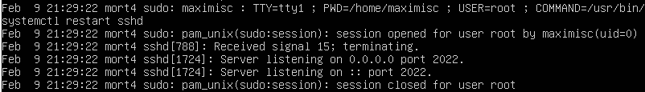

# Операционные системы UNIX/Linux (Базовый)

Установка и обновления системы Linux. Основы администрирования.

## Contents

1. [Chapter I](#chapter-i) \
    1.1 [Установка ОС](#part-1-установка-ос)  
    1.2 [Создание пользователя](#part-2-создание-пользователя)  
    1.3 [Настройка сети ОС](#part-3-настройка-сети-ос) \
    1.4 [Обновление ОС](#part-4-обновление-ос)  
    1.5 [Использование команды  sudo](#part-5-использование-команды-sudo)  
    1.6 [Установка и настройка службы времени](#part-6-установка-и-настройка-службы-времени)  
    1.7 [Установка и использование текстовых редакторов](#part-7-установка-и-использование-текстовых-редакторов)  
    1.8 [Установка и базовая настройка сервиса SSHD](#part-8-установка-и-базовая-настройка-сервиса-sshd) \
    1.9 [Установка и использование утилит top, htop](#part-9-установка-и-использование-утилит-top-htop) \
    1.10 [Использование утилиты fdisk](#part-10-использование-утилиты-fdisk) \
    1.11 [Использование утилиты df](#part-11-использование-утилиты-df) \
    1.12 [Использование утилиты du](#part-12-использование-утилиты-du) \
    1.13 [Установка и использование утилиты ncdu](#part-13-установка-и-использование-утилиты-ncdu) \
    1.14 [Работа с системными журналами](#part-14-работа-с-системными-журналами) \
    1.15 [Использование планировщика заданий CRON](#part-15-использование-планировщика-заданий-cron)

## Chapter I

## Part 1. Установка ОС

**== Задание ==**

##### Установи **Ubuntu 20.04 Server LTS** без графического интерфейса. (Используем программу для виртуализации - VirtualBox)

- Графический интерфейс должен отсутствовать.

- Узнай версию Ubuntu, выполнив команду \
`cat /etc/issue.`
- Вставь скриншот с выводом команды.

**== Выполнение задания ==**

- Проверка версии установленной ubuntu


## Part 2. Создание пользователя

**== Задание ==**

##### Создай пользователя, отличного от созданного при установке. Пользователь должен быть добавлен в группу `adm`.

**== Выполнение задания ==**

- Создание нового пользователя, комманда `sudo adduser <имя нового пользователя>`


- отображение нового пользователя при использваонии команды `cat /etc/passwd` \


- добавление нового пользователя в группу `adm` \


## Part 3. Настройка сети ОС

**== Задание ==**

##### Задай название машины вида user-1.
##### Установи временную зону, соответствующую твоему текущему местоположению.  
##### Выведи названия сетевых интерфейсов с помощью консольной команды.
- В отчёте дай объяснение наличию интерфейса lo.  
##### Используя консольную команду, получи ip адрес устройства, на котором ты работаешь, от DHCP сервера. 
- В отчёте дай расшифровку DHCP.  
##### Определи и выведи на экран внешний ip-адрес шлюза (ip) и внутренний IP-адрес шлюза, он же ip-адрес по умолчанию (gw). 
##### Задай статичные (заданные вручную, а не полученные от DHCP сервера) настройки ip, gw, dns (используй публичный DNS серверы, например 1.1.1.1 или 8.8.8.8).  
##### Перезагрузи виртуальную машину. Убедись, что статичные сетевые настройки (ip, gw, dns) соответствуют заданным в предыдущем пункте.  

**== Выполнение задания ==**

- Задание названия машины `sudo hostname <имя машины>` сохраниться до перезагрузки, `sudo hostnamectl set-hostname <имя машины>`сохраниться после перезагрузки \

- после перезагрузки название машины изменилось \


---

- установка времени по месту нахождения командой `sudo dpkg-reconfigure tzdata` \


  


- проверка времени командой `timedatectl` \


---

- вывод сетевых интейфейсов командой `ip link show`


> **lo (loopback device)** – виртуальный интерфейс, присутствующий по умолчанию в любом Linux. Он используется для отладки сетевых программ и запуска серверных приложений на локальной машине. С этим интерфейсом всегда связан адрес 127.0.0.1. У него есть dns-имя – localhost.
---

- Командой `cat /var/log/syslog | grep -i 'dhcp'` получаем ip устройства от DHCP


> **DHCP** – Dynamic Host Configuration Protocol (протокол динамической конфигурации хоста). Это механизм динамической выдачи IP-адресов в сети. IP-адрес (Internet Protocol) - способ адрессации устройств по сети. У каждого устройства свой уникальный ip-адрес. Без DHCP-сервера, администратору пришлось бы вручную настраивать статический IP-адрес каждого устройства, что при большом количестве устройст могло бы привести к ошибке.

---

- Внешний и внутренный ip-адреса  можно узнать командами `curl ifconfig.co` и `hostname -I` соответственно. \


---

- Зададим статичный ip-адрес, dns, gw.
- Для этого открываем конфигурационный файл Netplan командой `sudo nano /etc/netplan/00-installer-config-wsl.yaml` и зададим следюущие статические настройки \


- Для применения изменений используем команду `sudo netplan apply`
и после перезагружаем виртуальную машину.
- Проверяем сохранились ли наши настрйоки. \


---

- Пингуем удаленные хосты 1.1.1.1 и ya.ru \


## Part 4. Обновление ОС

**== Задание ==**

##### Обнови системные пакеты до последней на момент выполнения задания версии.

- После обновления системных пакетов, если ввести команду обновления повторно, должно появиться сообщение, что обновления отсутствуют;
- Вставь скриншот с этим сообщением в отчёт.

**== Выполнение задания ==**

- Обновление пакетов
- Для обновления пакетов используем команду `sudo apt update` и `sudo apt upgrade`

- После чего повторно вызываем команду `sudo apt update` для проверки обновлений


## Part 5. Использование команды sudo

**== Задание ==**

##### Разреши пользователю, созданному в [Part 2](#part-2-создание-пользователя),выполнять команду sudo.

- В отчёте объясни *истинное* назначение команды sudo (про то, что это слово - «волшебное», писать не стоит);  
- Поменяй hostname ОС от имени пользователя, созданного в пункте [Part 2](#part-2-создание-пользователя) (используя sudo);
- Вставь скрин с изменённым hostname в отчёт.

**== Выполнение задания ==**

- Для проврерки заходим под другого пользователя и проверяем его на отсутсвие прав `sudo`.
- Затем наделим его правами командой `sudo adduser <имя пользователя> sudo` и выполним проверку изменение названия машины.


## Part 6. Установка и настройка службы времени

**== Задание ==**

##### Настрой службу автоматической синхронизации времени.

- Выведи время часового пояса, в котором ты сейчас находишься.
- Вывод следующей команды должен содержать `NTPSynchronized=yes`: \
  `timedatectl show`
- Вставь скрины с корректным временем и выводом команды в отчёт.

**== Выполнение задания ==**

- Настройка времени \


## Part 7. Установка и использование текстовых редакторов

**== Задание ==**

##### Установи текстовые редакторы **VIM** (+ любые два по желанию **NANO**, **MCEDIT**, **JOE** и т.д.)
##### Используя каждый из трех выбранных редакторов, создай файл *test_X.txt*, где X -- название редактора, в котором создан файл. Напиши в нём свой никнейм, закрой файл с сохранением изменений.
- В отчёт вставь скриншоты:
  - Из каждого редактора с содержимым файла перед закрытием;
- В отчёте укажи, что сделал для выхода с сохранением изменений.
##### Используя каждый из трех выбранных редакторов, открой файл на редактирование, отредактируй файл, заменив никнейм на строку «21 School 21», закрой файл без сохранения изменений.
- В отчёт вставь скриншоты:
    - Из каждого редактора с содержимым файла после редактирования;
- В отчёте укажи, что сделал для выхода без сохранения изменений.
##### Используя каждый из трех выбранных редакторов, отредактируй файл ещё раз (по аналогии с предыдущим пунктом), а затем освой функции поиска по содержимому файла (слово) и замены слова на любое другое.
- В отчёт вставь скриншоты:
    - Из каждого редактора с результатами поиска слова;
    - Из каждого редактора с командами, введёнными для замены слова на другое.

**== Выполнение задания ==**

- установим текствые редакторы `nano`, `vim`, `mcedit` командами:
`sudo apt install nano`
`sudo apt install vim`
`sudo apt install mcedit`

### Запись никнеймов

- **VIM**
Для выхода с сохранением нужно нажать `Esc`, затем написать `:wq`, что означает write and quit. \

- **NANO**
Для выхода с сохранением нужно выполнить `Ctrl+S` и `Ctrl+X` \

- **MCEdit**
Для выхода с сохранением необходимо нажать `F10` и выбрать `Yes`. \


---

### Замена содержимого файла с выходом без сохранения

- **VIM**
Для выхода без сохранения нужно нажать `Esc`, затем написать `:q!`. \


- **NANO**
Для выхода без сохранения нужно нажать `Esc`, затем `Ctrl + X`. \


- **MCEdit**
Для выхода без сохранения нужно нажать `F10`, затем выбрать `No`. \


---

### Поиск и замена в текстовом редакторе

- **VIM**
- Поиск проводим командой `/<найденный текст>` \

- замену проводим командой `:%s/<найденный текст>/<заменяемый текст>` \


- **NANO**
- Поиск `ctrl + w` \

- замену производим командами `ctrl + w` затем `ctrl + r`, сначала пишем заменяемое слово и нажимаем `enter` \

- затем пишем новое слово и нажимаем `enter` \


- **MCEdit**
- Поиск `F7` \

- Замена `F4` \


## Part 8. Установка и базовая настройка сервиса SSHD

**== Задание ==**

##### Установи службу SSHd.  
##### Добавь автостарт службы при загрузке системы.  
##### Перенастрой службу SSHd на порт 2022.  
##### Используя команду ps, покажи наличие процесса sshd. Для этого к команде нужно подобрать ключи.

**== Выполнение задания ==**

- Установка сервиса SSHD просиходит командой `sudo apt install openssh-server`
- автостарт сервиса SSHD просиходит командой `sudo systemctl enable sshd`


- Для настройки сервиса перейдем в его конфиг файл командой `sudo nano /etc/ssh/sshd_config`. По умолчанию порт задан 22, изменим на 2022


- командой ps покажем наличие процесса sshd \


> ключ **а** - Показывает процессы всех пользователей, а не только текущего.
    ключ **u** - Выводит расширенную информацию о процессах
    ключ **x** - Показывает все процессы, включая те, которые не связаны с терминалом (такие как демоны или службы)
    **grep sshd** - выводит процессы, которые связаны с sshd

- команда `netstat -tan` \


> ключ **t** - Отображает только TCP-соединения
    ключ **a** - Показывает все активные соединения
    ключ **n** - Отображает числовые адреса вместо их символьных имен.
    **0.0.0.0** - отображает все соединения,
    **Recv-Q** и **Send-Q** - равно 0, это означает, что в данный момент нет данных в очереди ожидающих принятия и отправки.

## Part 9. Установка и использование утилит **top**, **htop**

**== Задание ==**

##### Установи и запусти утилиты top и htop.  

- По выводу команды top определи и напиши в отчёте:
  - uptime
  - количество авторизованных пользователей
  - общую загрузку системы
  - общее количество процессов
  - загрузку cpu
  - загрузку памяти
  - pid процесса занимающего больше всего памяти
  - pid процесса, занимающего больше всего процессорного времени
- В отчёт вставь скрин с выводом команды htop:
  - отсортированному по PID, PERCENT_CPU, PERCENT_MEM, TIME
  - отфильтрованному для процесса sshd
  - с процессом syslog, найденным, используя поиск
  - с добавленным выводом hostname, clock и uptime  

**== Выполнение задания ==**

- Результат вывода команды **`top`** \

  - uptime - 1.08
  - количество авторизованных пользователей - 1
  - общая загрузка системы - 0
  - общее количество процессов - 121
  - загрузка cpu - 0.1
  - загрузка памяти - 174.8
  - pid процесса занимающего больше всего памяти - 735
  - pid процесса, занимающего больше всего процессорного времени - 1

- сортировка pid по занимающей памяти \


- Результат вывода команды **`htop`** \

  - Сортировка по **PID** \
  
  - Сортировка по **PERCENT_CPU** \
  
  - Cортировка по **PERCENT_MEM** \
  
  - Cортировка по **TIME** \
  
  - Фильтрация по **sshd** \
  
  - Поиск процесса **syslog** \
  
  - Добавление к выводу параметров **clock, hostname, uptime**
  

## Part 10. Использование утилиты fdisk

**== Задание ==**

##### Запусти команду fdisk -l.

**== Выполнение задания ==**


> Название жесткого диска - **VBOX HARDDISK**
Размер жесткого диска - **20gb**
Секторов в жестком диске - **41943040**
Размер swap - **0**

## Part 11. Использование утилиты **df**

**== Задание ==**

##### Запусти команду df.

- В отчёте напиши для корневого раздела (/):
  - размер раздела
  - размер занятого пространства
  - размер свободного пространства
  - процент использования
- Определи и напиши в отчёт единицу измерения в выводе.  

##### Запусти команду df -Th.

- В отчёте напиши для корневого раздела (/):
    - размер раздела
    - размер занятого пространства
    - размер свободного пространства
    - процент использования
- Определи и напиши в отчёт тип файловой системы для раздела.

**== Выполнение задания ==**

- Запуск команды `df` \


```
для корневого раздела (/):
  - размер раздела - 10218772
  - размер занятого пространства - 3146252
  - размер свободного пространства - 6531848
  - процент использования 33%
  - единица измерения - Килобайт
```

- Запуск команды `df -Th` \


```
для корневого раздела (/):
  - размер раздела - 9.8gb
  - размер занятого пространства - 3.1gb
  - размер свободного пространства - 6.3gb
  - процент использования 33%
  - единица измерения - Гб.
```

## Part 12. Использование утилиты **du**

**== Задание ==**

##### Запусти команду du
##### Выведи размер папок /home, /var, /var/log (в байтах, в человекочитаемом виде)
##### Выведи размер всего содержимого в /var/log (не общее, а каждого вложенного элемента, используя *)

**== Выполнение задания ==**

- Запуск команды в человекочитаемом виде `sudo du -sh /home /var /var/log` \

- В байтах \

- Размер всего содержимого в `/var/log`. \


## Part 13. Установка и использование утилиты **ncdu**

**== Задание ==**

##### Установить утилиту ncdu
##### Вывести размер папок /home, /var, /var/log.

**== Выполнение задания ==**

- `/home` \

- `/var` \

- `/var/log` \


## Part 14. Работа с системными журналами

**== Задание ==**

##### Открой для просмотра:
##### 1. /var/log/dmesg
##### 2. /var/log/syslog
##### 3. /var/log/auth.log  

**== Выполнение задания ==**

- `/var/log/dmesg` \

- `/var/log/syslog` \

- `/var/log/auth.log` \


``` 
- Время последней сессии 11 Feb 15:30:42
- Имя пользователя maximisc
- Метод входа by uid = 0
```

- рестарт службы sshd \


## Part 15. Использование планировщика заданий **CRON**

**== Задание ==**

##### Используя планировщик заданий, запусти команду uptime через каждые 2 минуты.

- Найди в системных журналах строчки (минимум две в заданном временном диапазоне) о выполнении;
- Выведи на экран список текущих заданий для CRON;
- Вставь в отчёт скрины со строчками о выполнении и списком текущих задач.

##### Удалить все задания из планировщика заданий

- В отчёт вставь скрин со списком текущих заданий для CRON.

**== Выполнение задания ==**

- Открываем конфиг командой `crontab -e` и записываем строку `*/2 * * * * uptime`

- Выводим на экран список текущих заданий для CRON командой `crontab -l`

- Строчки выполнения uptime \

- Очистить все задания из планировщика заданий командой `crontab -r` и проверка списка заданий `crontab -l` \

